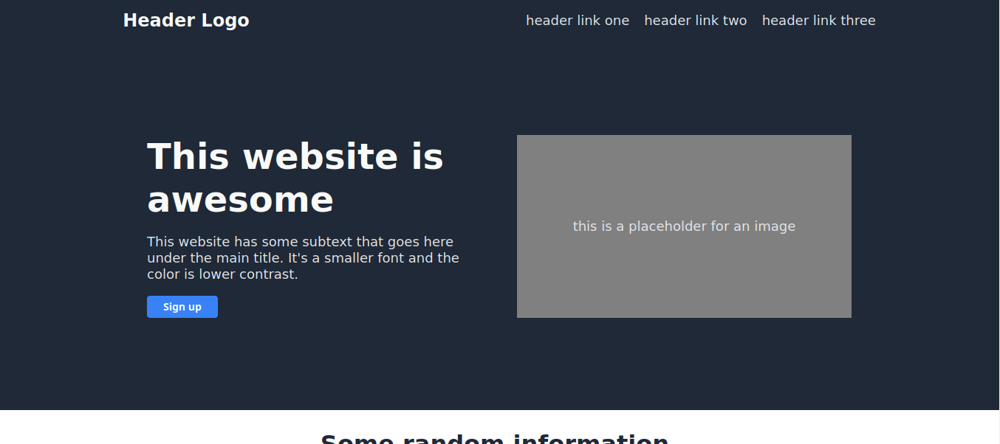

# Readme
# Landing Page

## Overview

See the design requirements from the Odin Project curriculum [here](https://www.theodinproject.com/paths/foundations/courses/foundations/lessons/landing-page). 

### Screenshot

  

### Links

- [Live site](https://mattdimicelli.github.io/landing-page/)
- [Repo](https://github.com/mattdimicelli/landing-page)

## My process

### Built with
- HTML
- CSS
- Git
- Github Hosting

### What I learned

See project description.

